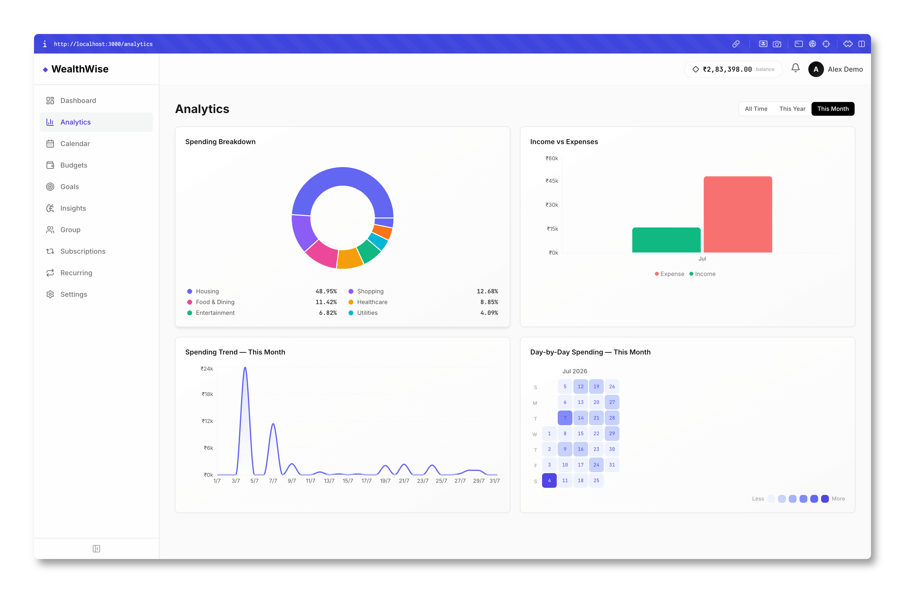
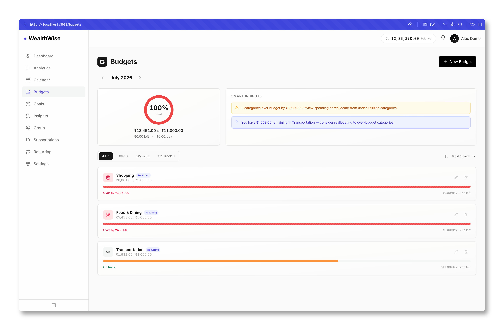
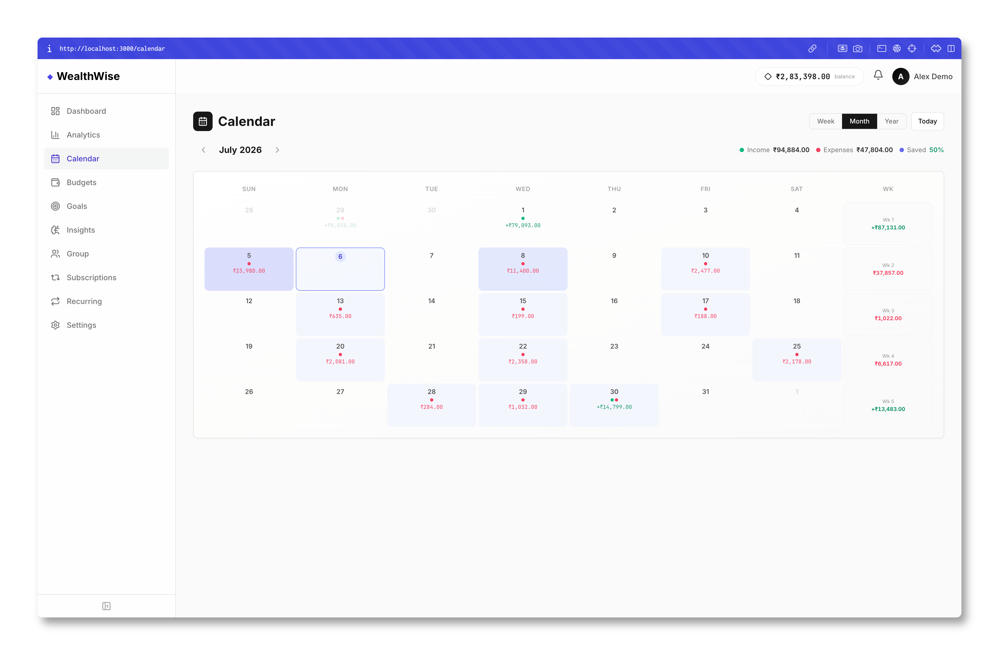
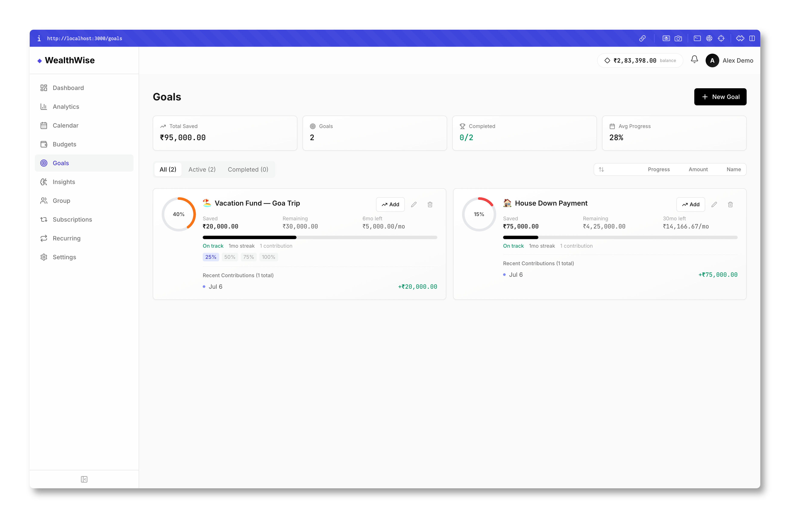
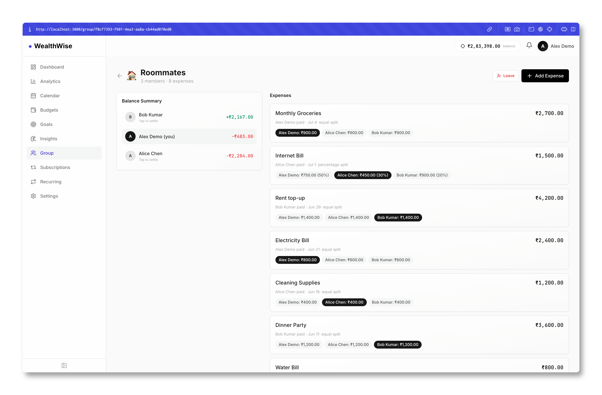
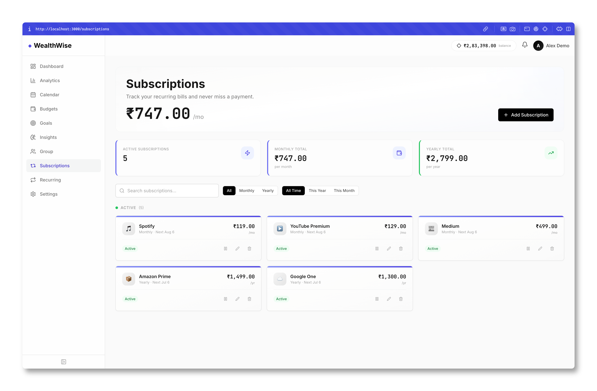

<div align="center">

# ◆ WealthWise

### Your money, but actually organized.

A personal finance tracker that runs 100% on your machine. No cloud, no subscriptions to *our* app (ironic, I know), no data leaving your laptop. Just you and your spreadsheets — except this one doesn't crash when you add a column.

<br/>

<a href="https://nextjs.org/"> Next.js 14</a> · 
<a href="https://www.typescriptlang.org/"> TypeScript 5</a> · 
<a href="https://tailwindcss.com/"> Tailwind CSS</a> · 
<a href="https://www.prisma.io/"> Prisma ORM</a> · 
<a href="https://www.sqlite.org/"> SQLite</a> · 
<a href="https://github.com/pmndrs/zustand"> Zustand</a> · 
<a href="https://recharts.org/"> Recharts</a> · 
<a href="https://zod.dev/"> Zod</a> · 
<a href="https://lucide.dev/"> Lucide</a> · 
<a href="LICENSE"> MIT License</a>

</div>

---

## What does it actually do?

Glad you asked. It does the things your bank app *should* do but charges you $12.99/mo for:

- Track income and expenses with categories
- Set budgets and watch yourself fail them in real-time
- Save toward goals (vacation fund, emergency fund, "I'll buy it someday" fund)
- Split bills with roommates without the passive-aggressive texts
- See all your subscriptions and realize you're paying $2,799/year for stuff you forgot about
- Import/Export CSV because you're secretly a spreadsheet person

---

## Screenshots

### Dashboard

*The "oh no, I spent how much?" view. Balance, spending trends, top categories, and your recent transactions all in one place.*

### Analytics

*Charts that make you feel like a Wall Street analyst, except it's your ₹500 chai habit breaking down the numbers.*

### Budgets

*Set budgets, get warnings when you're over, and receive "smart insights" that are basically just polite ways of saying "you messed up."*

### Calendar

*See where your money went on each day. Spoiler: most of those red dots are food deliveries.*

### Goals

*Track savings goals with progress rings and contribution history. The 40% on that Goa trip fund is looking pretty good right now.*

### Group Splits

*Split expenses with roommates. Handles equal splits, percentage splits, and shows who owes what. No more "I'll Venmo you later."*

### Subscriptions

*All your recurring payments in one place. Spotify, Netflix, that gym membership you used twice — they're all here.*

---

## Features

| Feature | What it does |
|---------|-------------|
| **Dashboard** | Net worth at a glance, spending trends, top categories, recent transactions |
| **Analytics** | Pie charts, bar charts, area charts, heatmaps — with period filtering |
| **Budgets** | Per-category budgets with progress bars and smart reallocation suggestions |
| **Savings Goals** | Track goals with ETA predictions, contribution history, and progress rings |
| **Subscriptions** | Track recurring bills, get renewal reminders, pause/resume |
| **Recurring** | Auto-generated recurring income/expense schedules |
| **Group Splits** | Split expenses equally or by percentage, track balances, settle up |
| **Calendar** | Week/month/year views showing transactions, subscriptions, and goal deadlines |
| **Insights Engine** | 15+ rule-based behavioral analysis rules and a financial health score |
| **CSV Import/Export** | Auto-detect columns, date formats, and transaction types |
| **Settings** | Profile management, currency preferences, category management |

---

## Tech Stack

Built with stuff I'd pick again:

| Layer | Tech | Why |
|-------|------|-----|
| Frontend | [Next.js 14](https://nextjs.org/) (App Router) | SSR, API routes, great DX |
| Language | [TypeScript](https://www.typescriptlang.org/) | Because `any` is a slippery slope |
| Styling | [Tailwind CSS](https://tailwindcss.com/) | Utility-first, ships fast |
| State | [Zustand](https://github.com/pmndrs/zustand) | Lightweight, no boilerplate |
| Charts | [Recharts](https://recharts.org/) | React-native charting that works |
| Database | [SQLite](https://www.sqlite.org/) | Zero config, file-based, portable |
| ORM | [Prisma](https://www.prisma.io/) | Type-safe queries, nice migrations |
| Auth | [jsonwebtoken](https://github.com/auth0/node-jsonwebtoken) + [bcryptjs](https://github.com/nicedoc/bcrypt.js) | JWT + password hashing |
| Validation | [Zod](https://zod.dev/) | Schema validation that actually catches typos |
| Icons | [Lucide React](https://lucide.dev/) | Clean, consistent icons |

---

## Quick Start

### Prerequisites

- Node.js 18+ and npm

### Setup

```bash
# Clone the repo
git clone https://github.com/saksham375/WealthWise.git
cd WealthWise

# Install dependencies
npm install

# Set up environment variables
cp .env.example .env
# Edit .env and set a secure JWT_SECRET (or don't, it's your localhost)

# Initialize the database and seed demo data
npm run setup

# Start the dev server
npm run dev
```

### Demo Accounts

| Email | Password | Currency |
|-------|----------|----------|
| demo@wealthwise.app | Demo@1234 | INR |
| alice@example.com | Alice@1234 | USD |
| bob@example.com | Bob@1234 | INR |

The demo account comes pre-loaded with 6 months of realistic data. You know, for when you want to pretend you're good with money.

---

## Available Scripts

| Script | What it does |
|--------|-------------|
| `npm run dev` | Start development server |
| `npm run build` | Build for production |
| `npm run start` | Start production server |
| `npm run setup` | Generate Prisma client, run migrations, and seed database |
| `npm run db:seed` | Re-seed the database with demo data |
| `npm run db:reset` | Reset database and re-seed |
| `npm run db:studio` | Open Prisma Studio (database GUI) |
| `npm run lint` | Run ESLint |
| `npm run type-check` | Run TypeScript type checking |

---

## Environment Variables

| Variable | Description | Default |
|----------|-------------|---------|
| `JWT_SECRET` | Secret key for JWT token signing | *(required)* |
| `DATABASE_URL` | SQLite database file path | `file:./dev.db` |
| `NODE_ENV` | Environment mode | `development` |
| `NEXT_PUBLIC_APP_URL` | Base URL for the app | `http://localhost:3000` |

---

## Project Structure

```
WealthWise/
├── prisma/                  # Database schema, migrations, seed scripts
│   ├── schema.prisma        # 18 data models with relations
│   ├── seed.ts              # Demo data generator (3 users, 6 months)
│   └── migrations/
├── public/                  # Static assets
├── screenshots/             # App screenshots for README
├── src/
│   ├── app/                 # Next.js App Router
│   │   ├── (app)/           # Authenticated routes (10 pages)
│   │   ├── (public)/        # Public routes (login, signup, forgot-password)
│   │   └── api/             # REST API endpoints (40+ routes)
│   ├── components/          # React components (40 files across 11 modules)
│   │   ├── analytics/       # Chart components (pie, bar, area, heatmap)
│   │   ├── budgets/         # Budget cards, donut, modal, suggestions
│   │   ├── calendar/        # Calendar views (week/month/year)
│   │   ├── goals/           # Goal cards, progress rings, contributions
│   │   ├── group/           # Expense splitting, balance summary
│   │   ├── insights/        # Financial score, insight cards
│   │   ├── recurring/       # Recurring transaction management
│   │   ├── settings/        # Category manager, import/export
│   │   ├── subscriptions/   # Subscription tracking
│   │   ├── transactions/    # Transaction modal, row, category picker
│   │   └── ui/              # Shared primitives (Toast, Toggle, EmptyState)
│   ├── data/                # Static data (categories, security questions, chart colors)
│   ├── hooks/               # Custom React hooks (API, currency formatting)
│   ├── lib/                 # Utilities (auth, validation, CSV, insights engine)
│   ├── store/               # Zustand stores (user, toast, analytics)
│   └── types/               # TypeScript type definitions
├── eslint.config.mjs
├── next.config.mjs
├── tailwind.config.ts
└── tsconfig.json
```

---

## Contributing

1. Fork the repository
2. Create a feature branch (`git checkout -b feature/amazing-feature`)
3. Commit your changes (`git commit -m 'Add amazing feature'`)
4. Push to the branch (`git push origin feature/amazing-feature`)
5. Open a Pull Request

If you break something, that's a feature now. Just make sure it passes `npm run lint`.

---

## License

MIT — do whatever you want with it. Just don't blame me if you realize you spend too much on food delivery after seeing the analytics.
