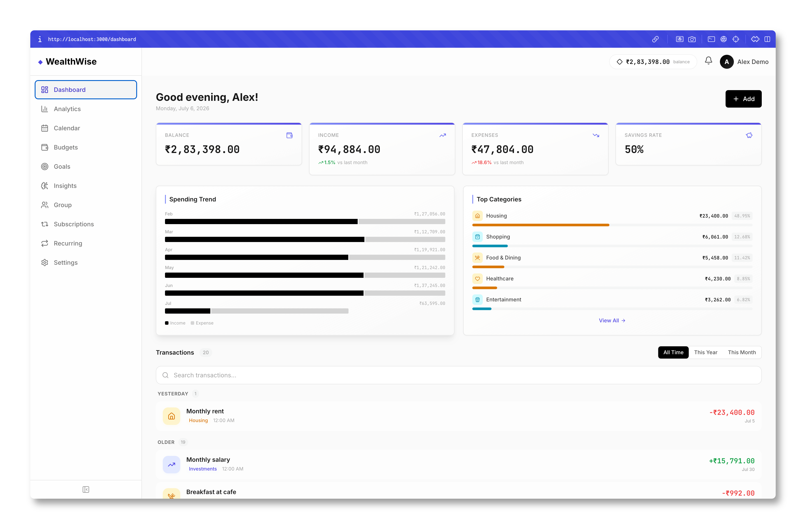

<div align="center">

# ◆ WealthWise

### Your Money. Your Rules. Total Clarity.

A complete, privacy-first personal finance tracker that runs entirely on your machine.
No cloud, no ads, no external APIs — just you and your money.

<br/>

<a href="https://nextjs.org/"> Next.js 14</a> · 
<a href="https://www.typescriptlang.org/"> TypeScript 5</a> · 
<a href="https://tailwindcss.com/"> Tailwind CSS</a> · 
<a href="https://www.prisma.io/"> Prisma ORM</a> · 
<a href="https://www.sqlite.org/"> SQLite</a> · 
<a href="https://github.com/pmndrs/zustand"> Zustand</a> · 
<a href="https://recharts.org/"> Recharts</a> · 
<a href="https://zod.dev/"> Zod</a> · 
<a href="https://lucide.dev/"> Lucide</a> · 
<a href="LICENSE"> MIT License</a>

</div>

---

## Screenshots

> Add your screenshots to the `screenshots/` folder in the repo root, then reference them below.

<div align="center">

### Dashboard


### Analytics


### Budgets


### Group Splits


</div>

---

## Features

| | Feature | Description |
|---|---------|-------------|
|  | **Dashboard** | At-a-glance view of your net worth, spending trends, and financial health |
|  | **Analytics** | Interactive charts — pie, bar, area, heatmap — with period filtering |
|  | **Budgets** | Per-category budgets with smart reallocation suggestions and donut progress |
|  | **Savings Goals** | Track goals with ETA predictions, contribution history, and progress rings |
|  | **Subscriptions** | Track recurring bills, get renewal reminders, pause/resume |
|  | **Recurring** | Auto-generated recurring income/expense schedules |
|  | **Group Splits** | Split expenses equally or by percentage, track balances, settle up |
|  | **Calendar** | Week/month/year views showing transactions, subscriptions, and goal deadlines |
|  | **Insights Engine** | 15+ rule-based behavioral analysis rules and a financial health score |
|  | **CSV Import/Export** | Auto-detect columns, date formats, and transaction types |
|  | **Settings** | Profile management, currency preferences, category management |

## Tech Stack

| | Layer | Technology | Purpose |
|---|-------|------------|---------|
|  | **Frontend** | [Next.js 14](https://nextjs.org/) (App Router) | UI framework with SSR and API routes |
|  | **Language** | [TypeScript](https://www.typescriptlang.org/) | Type-safe development |
|  | **Styling** | [Tailwind CSS](https://tailwindcss.com/) | Utility-first CSS framework |
|  | **State** | [Zustand](https://github.com/pmndrs/zustand) | Lightweight client-side state |
|  | **Charts** | [Recharts](https://recharts.org/) | Data visualization |
|  | **Database** | [SQLite](https://www.sqlite.org/) | Local file-based database |
|  | **ORM** | [Prisma](https://www.prisma.io/) | Type-safe database queries |
|  | **Auth** | [jsonwebtoken](https://github.com/auth0/node-jsonwebtoken) + [bcryptjs](https://github.com/nicedoc/bcrypt.js) | JWT tokens + password hashing |
|  | **Validation** | [Zod](https://zod.dev/) | Schema validation |
|  | **Icons** | [Lucide React](https://lucide.dev/) | Beautiful icon library |

## Quick Start

### Prerequisites

- Node.js 18+ and npm

### Setup

```bash
# 1. Clone the repository
git clone https://github.com/saksham375/WealthWise.git
cd WealthWise

# 2. Install dependencies
npm install

# 3. Set up environment variables
cp .env.example .env
# Edit .env and set a secure JWT_SECRET

# 4. Initialize the database and seed demo data
npm run setup

# 5. Start the development server
npm run dev
```

The app will be available at [http://localhost:3000](http://localhost:3000).

### Demo Accounts

| Email | Password | Currency |
|-------|----------|----------|
| demo@wealthwise.app | Demo@1234 | INR |
| alice@example.com | Alice@1234 | USD |
| bob@example.com | Bob@1234 | INR |

## Available Scripts

| Script | Description |
|--------|-------------|
| `npm run dev` | Start development server |
| `npm run build` | Build for production |
| `npm run start` | Start production server |
| `npm run setup` | Generate Prisma client, run migrations, and seed database |
| `npm run db:seed` | Re-seed the database with demo data |
| `npm run db:reset` | Reset database and re-seed |
| `npm run db:studio` | Open Prisma Studio (database GUI) |
| `npm run lint` | Run ESLint |
| `npm run type-check` | Run TypeScript type checking |

## Environment Variables

| Variable | Description | Default |
|----------|-------------|---------|
| `JWT_SECRET` | Secret key for JWT token signing | *(required)* |
| `DATABASE_URL` | SQLite database file path | `file:./dev.db` |
| `NODE_ENV` | Environment mode | `development` |
| `NEXT_PUBLIC_APP_URL` | Base URL for the app | `http://localhost:3000` |

## Project Structure

```
WealthWise/
├── prisma/                  # Database schema, migrations, seed scripts
│   ├── schema.prisma        # 18 data models with relations
│   ├── seed.ts              # Demo data generator (3 users, 6 months)
│   └── migrations/
├── public/                  # Static assets
├── screenshots/             # App screenshots for README
├── src/
│   ├── app/                 # Next.js App Router
│   │   ├── (app)/           # Authenticated routes (10 pages)
│   │   ├── (public)/        # Public routes (login, signup, forgot-password)
│   │   └── api/             # REST API endpoints (40+ routes)
│   ├── components/          # React components (40 files across 11 modules)
│   │   ├── analytics/       # Chart components (pie, bar, area, heatmap)
│   │   ├── budgets/         # Budget cards, donut, modal, suggestions
│   │   ├── calendar/        # Calendar views (week/month/year)
│   │   ├── goals/           # Goal cards, progress rings, contributions
│   │   ├── group/           # Expense splitting, balance summary
│   │   ├── insights/        # Financial score, insight cards
│   │   ├── recurring/       # Recurring transaction management
│   │   ├── settings/        # Category manager, import/export
│   │   ├── subscriptions/   # Subscription tracking
│   │   ├── transactions/    # Transaction modal, row, category picker
│   │   └── ui/              # Shared primitives (Toast, Toggle, EmptyState)
│   ├── data/                # Static data (categories, security questions, chart colors)
│   ├── hooks/               # Custom React hooks (API, currency formatting)
│   ├── lib/                 # Utilities (auth, validation, CSV, insights engine)
│   ├── store/               # Zustand stores (user, toast, analytics)
│   └── types/               # TypeScript type definitions
├── eslint.config.mjs
├── next.config.mjs
├── tailwind.config.ts
└── tsconfig.json
```

## Contributing

1. Fork the repository
2. Create a feature branch (`git checkout -b feature/amazing-feature`)
3. Commit your changes (`git commit -m 'Add amazing feature'`)
4. Push to the branch (`git push origin feature/amazing-feature`)
5. Open a Pull Request

## License

This project is licensed under the MIT License — see the [LICENSE](LICENSE) file for details.
